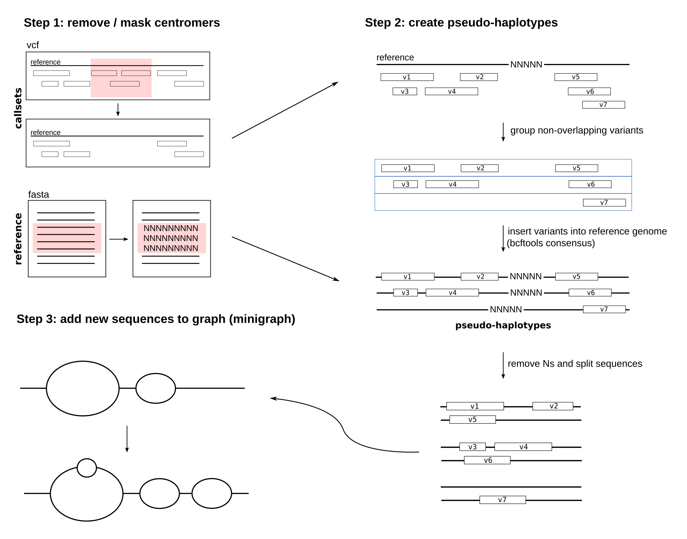

# Graph augmentation pipeline

This pipeline extends an existing minigraph pangenome graph by adding variant calls produced by different callsets (such as Delly, Sniffles2 or SVarp). For details on how to produce the results described here: https://www.biorxiv.org/content/10.1101/2024.04.18.590093v1 , see file `` SAGA.md ``.

## Dependencies

* conda
* snakemake

## Inputs

The pipeline expects the following inputs:

* **multi-sample VCF** files with sequence resolved variant calls across samples
* **minigraph GFA** files containing existing graph to be extended
* **reference FASTA** containing the reference sequence underlying the callsets
* **BED file**  used to mask certain regions (like centromeres) to avoid adding to complex sequence to the graph

The locations of these files need to be specified in the ``config/config.yaml`` file. The config file contains the following fields:

``` bat

# callsets with variants to be added to the graph
callset_vcfs:
 <callsetname1>: "/path/to/calls1.vcf.gz"
 <callsetname2>: "/path/to/calls2.vcf.gz"

# minigraph GFA of full genome.
minigraph_gfa: "/path/to/minigraph.gfa"

# reference sequence underlying the callsets
reference: "/path/to/reference.fa"

# BED to mask reference
mask: "/path/to/mask.bed"

# path to gaftools executable
gaftools: "/path/to/gaftools"


#######################################################
# optional arguments (needed for evaluation only)
####################################################### 

# reads of the samples to be used for validation. Files must be in SAM/BAM/CRAM format.
# # reads must be aligned to the same reference as listed above.
reads:
 <sample>: "/path/to/reads.cram"
```

Check out `` config/config.yaml `` for an example.

## Outputs

Results will be written to a folder called `` results/ ``. The main results are:

* **minigraph GFA** files with variants added. Located at `` results/minigraph/minigraph-extended_all.gfa ``
* **alignment statistics** (optional, only if cram files were supplied): Located at `` results/statistics/mapping/<extended|original>_all_<sample>_minigraph.stats ``


## What the pipeline does



* **Step 1:** remove variation in centromer regions and mask centromeres in reference genome
* **Step 2:** group non-overlapping variants and prduce "pseudo" haplotypes. For each such pseudo haplotype, a VCF file is produced containing the variants it covers. Next, a consensus sequence is constructed for each such pseudo haplotype by inserting the variants into the reference genome.
* **Step 3:** Add these new consensus sequences to the GFAs using minigraph


## How to run

Prepare the config file `` config/config.yaml `` as explained above. Then, run the pipeline using the following command:

``` bat
snakemake --use-conda -j <number of cores>
```
